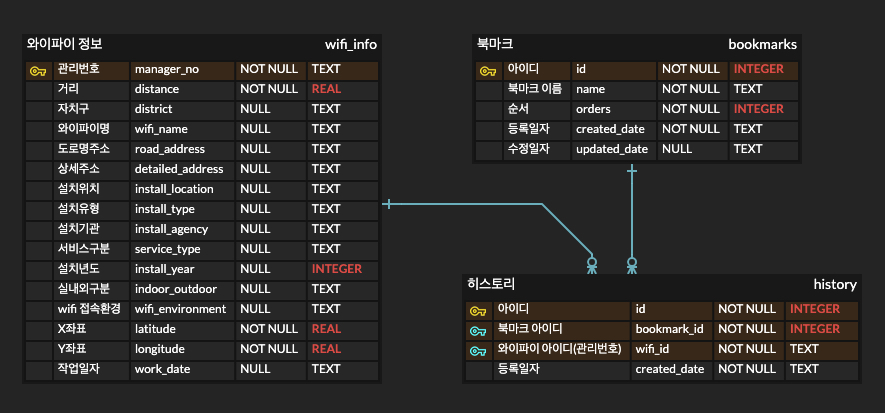

## ✅ 요구사항

1. 서울시 공공와이파이 서비스 위치 정보 OPEN API를 활용한 기능 구현
2. 공공 와이파이 정보 가져오기 기능 구현
3. 내 위치 정보를 입력하면 가까운 위치에 있는 와이파이 정보 20개 보여주는 기능 구현
4. 내가 입력한 위치정보에 대해서 조회하는 시점에 DB에 히스토리를 저장 및 보여주는 기능 구현

#### [서울시 공공 와이파이 서비스 위치 정보 링크](https://data.seoul.go.kr/dataList/OA-20883/S/1/datasetView.do)

## ✅ 세부 기능 정의

- 와이파이 서비스
    - 내 와이파이의 위치 정보 가져오기
    - 와이파이 정보 20개 크롤링
    - 와이파이 정보 상세
- 북마크 서비스
    - 북마크 목록
    - 북마크 생성
    - 북마크 수정 및 삭제
    - 와이파이 상세 정보에 대한 북마크 추가
- 히스토리
    - 와이파이 상세 정보에 대해 추가된 북마크 리스트 조회

## ✅ 시연 영상

#### 북마크 서비스 기능 시연

https://github.com/user-attachments/assets/aafcd50d-9708-49dd-8149-7bb664eb2eec


#### 와이파이 서비스, 히스토리 기능 시연

https://github.com/user-attachments/assets/ae66c136-1ba3-4dbf-81eb-33043a3b3c42


## ✅ ERD 설계



## ✅ 개발환경
- 언어 : ```Java```
- JDK(SDK) : ```Amazon Corretto 1.8```
- WAS : ```Apache Tomcat 9.0.102```
- DB : ```SQLite 3```
- 프론트 : ```JSP```

## ✅ 프로젝트 실행시 참고사항

```java
private String dbUrl;
private String apiKey;

public WifiInfoService() throws IOException {
    Properties properties = new Properties();
    loadProperties(properties);
    dbUrl = properties.getProperty("db.url");
    apiKey = properties.getProperty("api.key");
}

private void loadProperties(Properties properties) throws SQLException {
    try (InputStream input = getClass().getClassLoader().getResourceAsStream("config.properties")) {
        if (input == null) {
            throw new FileNotFoundException("config.properties not found in classpath");
        }
        properties.load(input);
    } catch (IOException e) {
        throw new SQLException("Error loading properties file", e);
    }
}

private List<Map<String, String>> fetchWifiData(double userLat, double userLon) throws IOException, ParserConfigurationException, SAXException {
    String apiUrl = "http://openapi.seoul.go.kr:8088/" + apiKey + "/xml/TbPublicWifiInfo/1/20/";
  
    String xmlData = makeApiRequest(apiUrl);
    return parseXmlData(xmlData, userLat, userLon);
}
```
소스코드에서 db 연결설정을 위해 프로젝트 디렉터리에 포함된 ```wifi.db```의 경로값을 가져와야 합니다.
프로젝트를 진행하는 과정에서 경로를 깃허브에 노출하지 않도록 하기 위해, ```/src/main/resources``` 하위 경로에 ```config.properties``` 파일을 추가하고 경로 설정을 추가하였습니다. 프로젝트 실행을 위해 다음과 같은 설정이 필요합니다.

- 예시
```properties
db.url=jdbc:sqlite:/(상위 경로)/public-open-api/wifi.db
```

api key는 해당 홈페이지에 로그인하여 발급받은 후, 위의 데이터베이스 경로 설정과 동일하게 설정을 추가하여야 합니다.

- 예시
```properties
api.key=56714d7964776XXXXXXXXXXXXXXX
```

## ✅ 기술적 이슈
- [인텔리제이에서 톰캣 환경 구축](https://velog.io/@jeongegg/Intellij-Community-%ED%86%B0%EC%BA%A3-%ED%99%98%EA%B2%BD-%EA%B5%AC%EC%B6%95)
